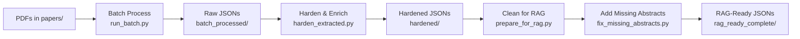

# Clean Pipeline Structure: PDF to RAG-Ready JSON

## Directory Structure

```
out/
├── batch_processed/        # Step 1: Raw extraction from PDFs via docling
├── hardened/               # Step 2: Hardened JSONs with UMLS, validation, enrichment
└── rag_ready_complete/     # Step 3: Final RAG-ready JSONs with all fixes

papers/                     # Original PDF files
reports/                    # Processing reports and statistics
```

## Essential Scripts for Pipeline

### Main Pipeline Scripts
1. **PDF Processing & Extraction**
   - `scripts/process_one_integrated.py` - Process single PDF with docling
   - `scripts/run_batch.py` - Batch process PDFs

2. **Enrichment & Hardening**
   - `scripts/harden_extracted.py` - Main hardening script with UMLS
   - `scripts/umls_linker.py` - UMLS concept linking
   - `scripts/enrich_online.py` - Online metadata enrichment
   - `scripts/dedupe_by_doi.py` - Remove duplicate papers

3. **RAG Preparation & Cleaning**
   - `scripts/prepare_for_rag.py` - Main cleaner with table extraction fixes
   - `scripts/fix_missing_abstracts.py` - PubMed abstract backfill
   - `scripts/add_manual_abstracts.py` - Manual abstract curation

### Audit & Validation Scripts
- `scripts/audit_abstracts.py` - Verify abstract coverage
- `scripts/audit_clean_jsons.py` - Audit cleaned JSON quality
- `scripts/validate_batch_results.py` - Validate batch processing
- `verify_complete_data.py` - Final verification script

### Utility Scripts (Keep)
- `scripts/reference_manager.py` - Reference handling
- `scripts/section_classifier.py` - Section classification
- `scripts/stats_extractor.py` - Extract statistics
- `scripts/table_normalizer.py` - Table normalization

## Pipeline Workflow



## Commands to Run Pipeline

```bash
# Step 1: Process PDFs to JSON (docling extraction)
python scripts/run_batch.py papers/ out/batch_processed/

# Step 2: Harden with UMLS and enrichment
python scripts/harden_extracted.py out/batch_processed/ out/hardened/

# Step 3: Clean for RAG
python scripts/prepare_for_rag.py out/hardened/ out/rag_ready_complete/ --mode full

# Step 4: Backfill missing abstracts from PubMed
export NCBI_EMAIL="your.email@example.com"
python scripts/fix_missing_abstracts.py out/rag_ready_complete/ --only-missing

# Step 5: Add manual abstracts if needed
python scripts/add_manual_abstracts.py out/rag_ready_complete/

# Step 6: Final audit
python scripts/audit_abstracts.py out/rag_ready_complete/
```

## Quality Metrics

Final dataset in `out/rag_ready_complete/`:
- 396 total files
- 100% abstract coverage
- 79% tables with headers
- 0 empty sections
- Complete clinical content preserved

## Removed/Deprecated

The following were removed during cleanup:
- `out/rag_ready/` - Initial attempt
- `out/rag_ready_fixed/` - Intermediate version
- `out/rag_ready_enhanced/` - Test version
- `out/rag_ready_final/` - Superseded by rag_ready_complete
- `out/rag_test/` - Test directory
- `out/raw_backup/` - Temporary backup
- Various test scripts and intermediate files